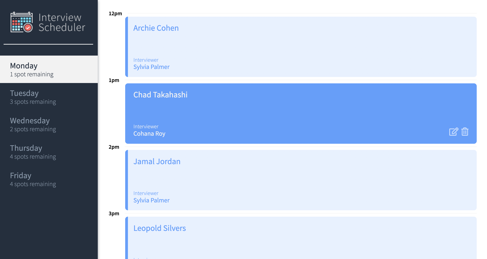
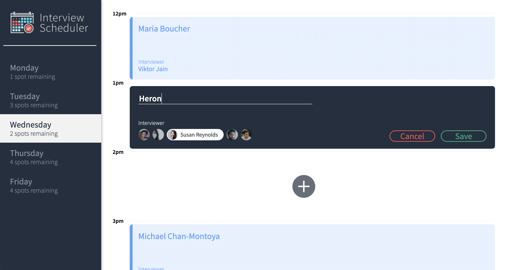

# Interview Scheduler
A web app created as an educational purpose to learn more about basic React functionalities.

The app requires the following database/server repo to run:
https://github.com/heronfeijao/scheduler-api

## Photos

### Layout


### Interview Form



## Setup

Install dependencies with `npm install`.

## Running Webpack Development Server

```sh
npm start
```

## Running Jest Test Framework

```sh
npm test
```

## Running Storybook Visual Testbed

```sh
npm run storybook
```
